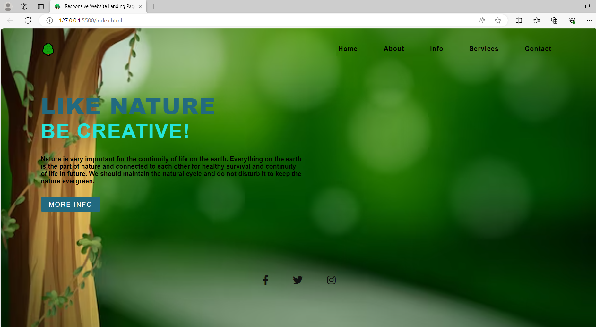

<h1>Landing-Page</h1>

he website landing page navigation menu is designed with only using pure CSS and HTML, no javascript used. This landing page title is <strong>"Creative Nature"</strong> and used color theme is simple and clear.

We use To add a favicon to your website, either save your favicon image to the root directory of your webserver, or create a folder in the root directory called images, and save your favicon image in this folder. A common name for a favicon image is "favicon. ico

